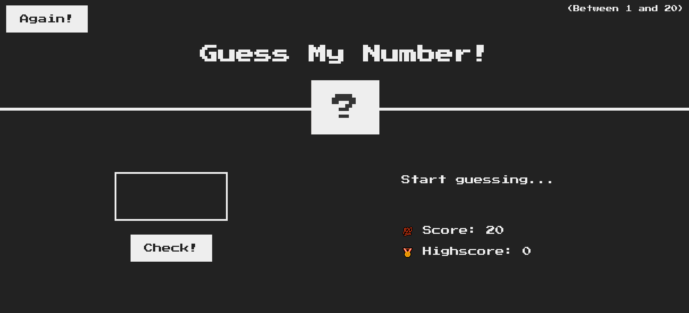

<h1 align="center" > <b>Guess My Number - Game 🎮</b> </h1>
 

   
<h2> <b>Description:</b></h2>
 

 Guess my number is a simple Web Application that was developed while i was studying DOM. 

DOM is an API that allows the interaction of script (JavaScript) with the Browser, treating documents (HTML & XML) as objects.

References: <a href = "https://www.notion.so/Masterclass-DOM-48ef7efae2ad4e0c8f9b462b675d2b0d"> DOM Master Class Rocketseat</a>, <a href="https://developer.mozilla.org/en-US/docs/Web/API/Document_Object_Model">MDN</a>

 
<h2><b>Tecnologies</b></h2>

The following tecnologies were used in the construction of the project:

- [HTML](https://developer.mozilla.org/en-US/docs/Web/HTML)
- [CSS](https://developer.mozilla.org/en-US/docs/Web/CSS)
- [JavaScript](https://developer.mozilla.org/en-US/docs/Web/JavaScript)
